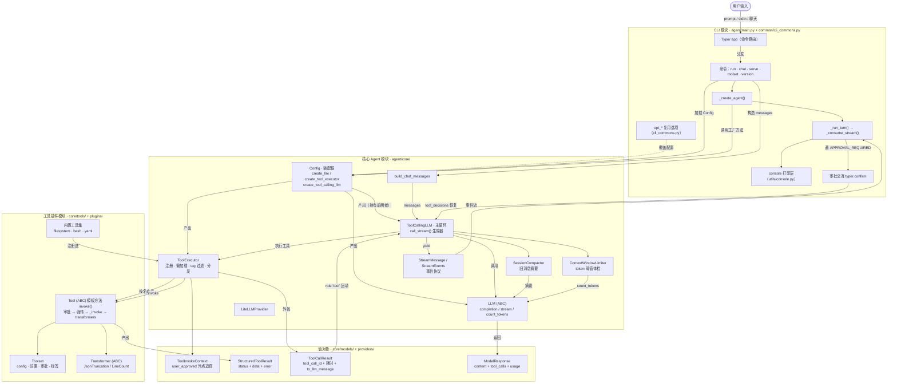

# 系统架构

`agent` 是一个通用 LLM Agent 框架。整体分三层：

- **CLI 模块**（`agent/main.py` + `agent/common/cli_commons.py`）：Typer 命令入口，负责接收用户输入、装配核心对象、消费事件流并渲染到终端。
- **核心 Agent 模块**（`agent/core/`）：`ToolCallingLLM` 主循环驱动「LLM ↔ 工具」交替执行，配压缩与上下文管控。
- **工具插件模块**（`agent/plugins/`）：`Toolset` / `Tool` / `Transformer` 插件基座，注册进 `ToolExecutor`。

## 整体流程图



## 模块速览

| 模块 | 路径 | 关键类 / 函数 |
|---|---|---|
| CLI 入口 | `agent/main.py` | `app`（Typer）、`_create_agent()`、`_create_multi_agent()`、`_run_turn()`、`_consume_stream()` |
| CLI 复用选项 | `agent/common/cli_commons.py` | `opt_api_key` / `opt_model` / `opt_config_file` 等 |
| 装配根 | `agent/config.py` | `Config.create_llm()` / `create_tool_executor()` / `create_tool_calling_llm()` |
| 主循环 | `agent/core/tool_calling_llm.py` | `ToolCallingLLM.call_stream()` |
| 供应商抽象 | `agent/core/providers/` | `LLM`(ABC)、`LiteLLMProvider`、`ModelResponse` |
| 工具分发 | `agent/core/tool_executor.py` | `ToolExecutor` |
| 工具基座 | `agent/core/tools/` | `Tool`(ABC)、`Toolset`、`Transformer`、`Prerequisite` |
| 值对象 | `agent/core/models/` | `ToolInvokeContext`、`StructuredToolResult`、`ToolCallResult`、`ShellResult` |
| 提示词装配 | `agent/core/prompts/` | `build_chat_messages()`、`build_system_prompt()`、`build_user_prompt()` |
| 压缩管控 | `agent/core/truncation/` | `SessionCompactor`、`ContextWindowLimiter` |
| 结果瘦身 | `agent/core/transformers/builtin.py` | `JsonTruncationTransformer`、`LineCountTransformer` |
| 事件协议 | `agent/utils/stream.py` | `StreamEvents`、`StreamMessage` |
| Agent 角色 | `agent/core/agents/` | `BaseAgent`(ABC)、`MainAgent`、`Orchestrator`、`BusinessAgent`、`SubAgent` |
| A2A 协议 | `agent/core/a2a/` | `protocol.py`（Task/Message/Part）、`InProcessA2AClient` |
| 终端适配 | `agent/core/env/terminal.py` | `TerminalType`、`detect_shell()`、`adapt_command()`、`execute_in_shell()` |
| 技能注入 | `agent/core/skills/` | `SkillLibrary`、`collect_env_info()`、`format_env_info()` |
| 历史存储 | `agent/core/history/store.py` | `HistoryRecord`、`HistoryStore` |
| 轻量沙箱 | `agent/plugins/toolsets/sandbox/` | `RunSandboxCommand`、`create_sandbox_toolset()` |

## 类层次要点

- **模板方法模式**：`Tool.invoke()` 锁定固定五步（审批 → 参数强转 → `_invoke()` → transformers → 返回），子类只覆写 `_invoke()`。
- **污点追踪**：`ToolInvokeContext.user_approved` 是核心状态位——`False` 表示参数来自 LLM（脏），执行前需审批/校验；`True` 表示已人工批准（干净）。
- **结果适配分离**：`StructuredToolResult`（工具产出）与 `ToolCallResult`（LLM 协议层适配，附 `tool_call_id` 与耗时）分离，使工具实现与引擎无关。
- **双暂停恢复**：`call_stream()` 是生成器，遇 `APPROVAL_REQUIRED` / `FRONTEND_PAUSE` 会提前 return，下次以 `tool_decisions` / `frontend_tool_results` 恢复。

## 主循环深入：call_stream() 事件流机制

`call_stream()` 是**生产者生成器**，消费端 `_consume_stream()`（`agent/main.py:144`）用 `for event in agent.call_stream(...)` 逐个接收 `StreamMessage` 事件并渲染。事件流让「引擎产生事件」与「前端/CLI 渲染」解耦：`call_stream` 不碰任何 IO，`_consume_stream` 只按 `event.event` 分派（打印、转圈、捕获 `final` 与 `pause`），返回 `(final, pause)`。

### 双层生成器 + 消费端循环（习惯上称"三层"）

```
[层①] for event in agent.call_stream(...)   # 消费端循环（_consume_stream）：不是生成器，驱动外层
[层②]     while True:                        # call_stream 生成器本体
[层③]         delta = next(deltas)           # completion_stream 生成器（deltas）：yield 字符串增量
```

严格数**生成器对象只有 2 个**：`call_stream(...)` 返回的（yield `StreamMessage`）与 `completion_stream(...)` 返回的（`deltas`，yield 文本增量）。"第三层"指**消费端的 `for` 循环**（`_consume_stream` 里 `for event in agent.call_stream(...)`）——它不是迭代器，而是驱动外层生成器的消费者。数迭代器对象是 2 个，数嵌套环节（消费者 → call_stream → completion_stream）是 3 层。

- `self.llm.completion_stream(...)` 返回的是**生成器而非响应**——yield 出文本增量，结束时把 `ModelResponse` 作为 return 值塞进 `StopIteration.value`。
- 内层 `while True: next(deltas)` 手动驱动，是为了捕获 `stop.value`；`for delta in deltas:` 会丢弃生成器的 return 值。
- `yield` 只是暂停交接（把事件交给消费者，随后继续），`return` 才真正结束生成器。

### 一轮迭代流程

1. **发起 LLM 调用**：`completion_stream(messages, tools, tool_choice)`。`is_last_step`（`i >= max_steps`）时传 `tools=None` + `tool_choice="none"` 强制模型收尾。
2. **转发增量**：每段 `delta` 以 `ANSWER_DELTA` 事件 yield 给消费者。
3. **固化历史**：把 assistant 消息（content + tool_calls）追加进 `session_history`，供下一轮 LLM 调用看到。
4. **情况 A——无工具调用**：yield `ANSWER_END`（含完整历史 + usage + `num_llm_calls`）后 `return`，整条链结束。
5. **情况 B——有工具调用**：逐个 yield `START_TOOL`（递增 `tool_number`），再 `ThreadPoolExecutor(16)` 并行执行。
6. **收结果**（`as_completed`）：普通结果 → 追加 tool 消息进历史 + yield `TOOL_RESULT`；`APPROVAL_REQUIRED` → 记入 `approval_pauses` 暂不落地；`FRONTEND_PAUSE` → 记入 `frontend_pause`。**必须收完整个批次再暂停**，否则兄弟调用的 `tool_call_id` 成为孤儿。
7. **批次收完分岔**：有审批 → yield `APPROVAL_REQUIRED`（带 `pending_approvals` 列表）后 `return`；有前端暂停 → yield `FRONTEND_PAUSE` 后 `return`；都没有 → `i += 1` 进入下一轮。
8. **循环耗尽兜底**：`max_steps` 到达仍无无工具答案时，取最后一条 assistant 内容发 `ANSWER_END`（`max_steps_reached=True`），无内容才发 `ERROR`——绝不静默返回。

### 暂停、恢复与兜底

- **暂停 = 提前 `return`**（不抛异常）：`call_stream` 生成器结束，消费者拿到 `pause` 信息停止消费。
- **恢复 = 重新调用 `call_stream`**：带上 `tool_decisions`（tool_call_id → bool）或 `frontend_tool_results`，并传 `tool_number_offset` / `iteration_offset` 接着上次的计数。
- **审批决策落地** `_execute_tool_decisions`：已批准的调用以 `user_approved=True` 重放执行（返回实际执行数，`tool_number += approved_count` 推进编号），拒绝的追加拒绝型 tool 消息；处理完立即 `tool_decisions = {}`，防止下一轮循环重复执行。
- **孤儿调用兜底** `_resolve_orphaned_tool_calls`：LLM 调用前扫描历史，为所有无响应的 `tool_call_id` 注入取消型拒绝结果（从后往前遍历 + `insert_offset` 保持配对顺序）。

### 供应商硬约束

assistant 消息出现 `tool_calls` 后，每个 `id` 必须有一条 `role="tool"` 响应。这是 API 服务端的**结构校验**（推理时 400 错误，与具体模型无关），不是模型训练问题；训练只影响"跳过结果时模型输出质量下降"。因此所有「未执行却要回应 tool_call_id」的路径（拒绝、取消、孤儿）统一走 `_denial_result` 工厂，产出形态一致的供应商安全消息。
