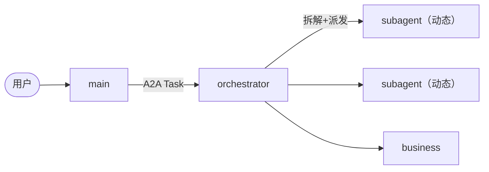

# 多Agent 编排

`agent chat --multi-agent` 启用多Agent 协作：固定 **1 主 Agent + 1 编排 Agent + 1 业务 Agent**，命令子任务由**动态 SubAgent** 并行执行。

## 角色

| 角色 | 职责 | 类型 |
|---|---|---|
| main | 用户交互、整体调度、终局归纳（现有 `ToolCallingLLM` 的包装） | 固定 |
| orchestrator | 任务拆解、并行调度、结果归并 | 固定 |
| business | 业务/领域子任务处理 | 固定 |
| subagent | 命令子任务执行（经沙箱/`bash` 工具） | 动态 |



协议采用 **A2A**（`a2a-sdk`）：Agent 间以 `Task` / `Message` / `Part` 交换工作单元。v1 为进程内 transport（`InProcessA2AClient`），预留 HTTP 端点扩展点。

## 用法

```bash
agent chat --multi-agent
```

示例输入（编排层会拆解、并行执行并归并结果）：

```text
分析当前目录的磁盘占用，并列出最大的三个目录
```

## 安全与环境适配

- 命令子任务优先走**轻量沙箱**（`sandbox` 工具：审批层 + 子进程隔离 + 超时 + 受控工作目录），未注册时回退 `bash`。
- 执行前探测终端并改写同义命令（`ls` ↔ `Get-ChildItem` 等），见 `agent/core/env/terminal.py`。
- 高风险命令（未命中白名单）要求人工审批；敏感路径（`~/.ssh` 等）绝对拒绝。

## 技能与环境信息

- **技能注入**：本地技能库按任务文本自动匹配，命中则把指令注入编排/主 Agent 提示词。

  ```bash
  agent skills add path/to/skill.yaml
  ```

- **环境信息**：启动时采集 cwd / shell / 平台 / 可用工具，注入 Agent 上下文。

## 历史记录

命令执行与会话生命周期（open/close）自动落库（JSONL）：

```bash
agent history session <session-id>
agent history command <pattern>
```
